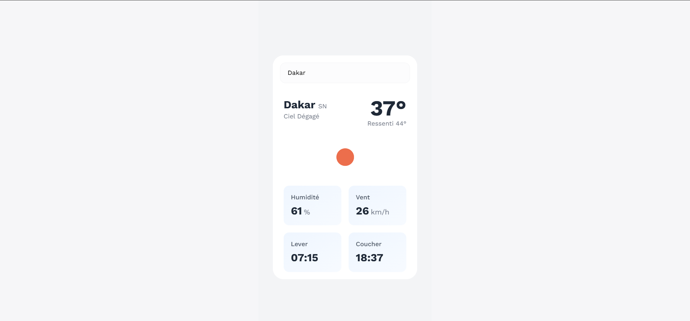

# Weather App 🌤️

A simple weather application built with Nuxt.js that displays current weather conditions using the OpenWeatherMap API.



## ✨ Features

- Current weather display
- Intuitive user interface
- Responsive design
- City search functionality

## 🚀 Installation

1. Clone the repository:
```bash
git clone https://github.com/your-username/weather-app.git
cd weather-app
```

2. Install dependencies:
```bash
npm install
# or
yarn install
```

3. Create a `.env` file in the root directory and add your OpenWeatherMap API key:
```env
NUXT_PUBLIC_OPENWEATHER_API_KEY=your_api_key_here
```

> **Note:** To get an API key, sign up at [OpenWeatherMap](https://openweathermap.org/) and generate a key in your dashboard.

## 🎮 Usage

To start the application in development mode:
```bash
npm run dev
# or
yarn dev
```

The application will be available at `http://localhost:3000`

## 🛠️ Technologies Used

- Nuxt.js
- OpenWeatherMap API
- TailwindCSS
